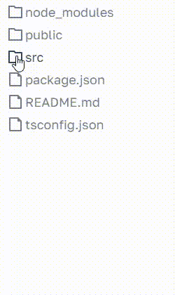

# Задачи для практики к собеседованиям на frontend-разработчика - Задачи по React

## Тех. Вопросы

- Как работает React? (Virtual DOM, Reconcilation, Fiber, что тригерит перерендер, как происходит сравнение props'ов)
- Методы жизненного цикла классового компонента. Аналоги в функциональном
- Для чего нужны react hooks? Какие хуки существуют включая 19 версию React? В чем разница хуков useEffect vs useLayoutEffect?
- Для чего нужен React.Context?
- Для чего нужен Redux? В чем суть Flux архитектуры?
- Какие еще знаешь state-manager'ы? В чем отличие от Redux?
- Способы оптимизации React-компонентов?
- [Advanced] Как бы ты организовал архитектуру фронтенд приложения
- Преимущества Next над React? Какую проблему он решает?

## Лайф-кодинг

### ✅ Задача
Выполнить рефакторинг

```ts
interface IProps extends React.PropsWithChildren
{
    isOpen: boolean;
    title: string;
    onModalClose: () => void;
    onSubmit: () => void;
}

const Modal: React.FC<IProps> = props => {
    useEffect(() => {
        if (props.isOpen) {
            document.title = props.title + ' - ' + document.title;
        }
        document.body.classList.add('overflow--hidden');
    }, []);

    const didModalClosed = useCallback(() => props.onModalClose(), []);


    return props.isOpen && (
        <>
            <div className="fade" onClick={didModalClosed}>
                <div className="modal">
                    <div className="header">
                        <h3 className="title">
                            {props.title}
                        </h3>
                        <button onClick={didModalClosed}>Close</button>
                    </div>
                    <div className="content">
                        {props.children}
                    </div>
                    <div className="footer">
                        <button onClick={props.onSubmit}>Submit</button>
                    </div>
                </div>
            </div>
        </>
    );
};
```

<details>
    <summary>Решение</summary>

```tsx
import React, { useState, useEffect, useCallback } from "react";

const useScrollLock = (props) => {
    const { isOpen } = props;

    useEffect(() => {
        if (isOpen) {
            document.body.classList.add("overflow--hidden");
        }  else {
            document.body.classList.remove("overflow--hidden");
        }
    }, [isOpen])
}

const Modal = (props) => {
    const { isOpen, title, onModalClose, onSubmit, children } = props;

    useScrollLock({ isOpen });

    const closeModal = useCallback(() => {
        console.log(':: close');
        onModalClose();
    }, []);

    if (!isOpen) {
        return null;
    }

    return (
        <div className="fade" onClick={closeModal}>
            <div className="modal">
                <div className="header">
                    <h3 className="title">{title}</h3>
                    <button onClick={closeModal}>Close</button>
                </div>
                <div className="content">{children}</div>
                <div className="footer">
                    <button type="button" onClick={onSubmit}>
                        Submit
                    </button>
                </div>
            </div>

        </div>
    )
}

// Использование
const App = () => {
    const [isOpen, setIsOpen] = useState(true);

    const handleClose = useCallback(() => {
        setIsOpen(false);
    }, [])

    return (
        <Modal
            isOpen={isOpen}
            title="Modal"
            onModalClose={handleClose}
            onSubmit={() => {}}
        />
    )
}
```
</details>

 ---
 <!--  ------------------------------------------------------------------------------------------------------------------------------------------------------- -->
 

### ✅ Задача

В App есть инпут, счетчик и дочерний компонент, который выполняет лишние ререндеры, при обновлении счетчика и изменении инпута как избежать лишних ререндеров дочернего

```js
import React,{ useState } from 'react';

export default function App() {
    const [input, setInput] = useState('');
    const [count, setCount] = useState(0);

    const increment = () => setCount(count + 1);

    return (
        <div>
            <input value={input} onChange={(e) => setInput (e.target.value)} /> 
            <p>Input text: {input}</p>
            
            <button onClick={increment}>Increment</button>
            <p>Count: {count}</p>

            <ChildComponent count={count} />
        </div>
    );
}

const ChildComponent = ({ count, increment }: any) => {
  console.log(":: render");
  return <div>Child component {count}</div>;
};
```


<details>
  <summary>Решение</summary>

```js
const ChildComponent = memo(({ count }: any) => {
    console.log(":: render");
    return (
        <>
          <div>Child component {count}</div>
        </>
    );
});
```
</details>


 ---
 <!--  ------------------------------------------------------------------------------------------------------------------------------------------------------- -->
 
### ✅ Задача

В App есть инпут, счетчик и дочерний компонент, который выполняет лишние ререндеры, при обновлении счетчика и изменении инпута  
Также есть функция increment, которая вызывается в App и передается для вызова в дочернем как избежать лишних ререндеров дочернего

```js
import React, { useState } from "react";
import ReactDOM, { createPortal } from "react-dom";

const App = () => {
  const [input, setInput] = useState("");
  const [count, setCount] = useState(0);

  const increment = () => {
	  setCount(count + 1);
  }

  return (
    <div>
      <input value={input} onChange={(e) => setInput(e.target.value)} />
      <p>Input text: {input}</p>

      <button
        onClick={increment}
      >
        Increment
      </button>
      <p>Count: {count}</p>

      <ChildComponent count={count} increment={increment} />
    </div>
  );
};

const ChildComponent = ({ count, increment }) => {
  console.log(":: render");
  return (
    <>
      <div>Child component {count}</div>
      <button onClick={increment}>Increment</button>
    </>
  );
};
```

<details>
    <summary>Решение</summary>

```js
import React, { useState, useEffect, useCallback, FC, memo } from "react";
import ReactDOM from "react-dom";

const App = () => {
  const [input, setInput] = useState("");
  const [count, setCount] = useState(0);

  const increment = useCallback(() => setCount(() => count + 1), []);

  return (
    <div>
      <input value={input} onChange={(e) => setInput(e.target.value)} />
      <p>Input text: {input}</p>

      <button onClick={increment}>Increment</button>
      <p>Count: {count}</p>

      <ChildComponent count={count} increment={increment} />
    </div>
  );
};

const ChildComponent = memo(({ count, increment }) => {
  return (
    <>
      <div>Child component {count}</div>
      <button onClick={increment}>Increment</button>
    </>
  );
});
```
</details>

---
 <!--  ------------------------------------------------------------------------------------------------------------------------------------------------------- -->


### ✅ Задача

1) Типизировать данные из файла data.json
2) Написать функцию, которая вернёт промис, который зарезолвится через 2 секунды с данными из data/data.json
3) Вывести на интерфейс названия полученных элементов в виде дерева (у каждого следующего уровня должен быть бОльший отступ слева)
4) Реализовать поиск по дереву (если дочерний элемент удовлетворяет условиям поиска, то должен отобразиться он и все его родители)
5) Добавить в поиск функцию debounce

```tsx
Название один
Второе название
    Винни-Пух
    Крокодил Гена
        Я уже устал придумывать названия
        Последнее название
    Чат GPT
Название третьего объекта
Объектов уже четыре
    Выходной
    Раскалённая лава
Пяточок
```

```json
// data.json
[
  {
    "id": 1,
    "name": "Название один"
  },
  {
    "id": 2,
    "name": "Второе название",
    "child": [
      {
        "id": 6,
        "name": "Винни-Пух",
        "child": []
      },
      {
        "id": 7,
        "name": "Крокодил Гена",
        "child": [
          {
            "id": 11,
            "name": "Я уже устал придумывать названия",
            "child": []
          },
          {
            "id": 12,
            "name": "Последнее название",
            "child": []
          }
        ]
      },
      {
        "id": 8,
        "name": "Чат GPT",
        "child": []
      }
    ]
  },
  {
    "id": 3,
    "name": "Название третьего объекта",
    "child": []
  },
  {
    "id": 4,
    "name": "Объектов уже четыре",
    "child": [
      {
        "id": 9,
        "name": "Выходной",
        "child": []
      },
      {
        "id": 10,
        "name": "Раскалённая лава",
        "child": []
      }
    ]
  },
  {
    "id": 5,
    "name": "Пяточок",
    "child": []
  }
]

```
 ```tsx
import React from "react";
import data from './data.json';

export default function App() {
    return (
        <div>

        </div>
    );
}
```


<details>
    <summary>Решение</summary>

```tsx
import React, { useState, useEffect, useMemo } from "react";
import data from './data.json';

interface TreeItem {
  id: number;
  name: string;
  child?: TreeItem[];
}

const delay = (timeout: number) => {
  return new Promise(resolve => setTimeout(resolve, timeout));
}

const getDataFromBackend = async () => {
  await delay(2000);
  return data;
}

type Props = {
  tree: TreeItem[];
}

const useDebounce = (value: string, timeout: number) => {
  const [debouncedValue, setDebouncedValue] = useState(value);

  useEffect(() => {
    const timer = setTimeout(() => {
      setDebouncedValue(value)
    }, timeout);

    return () => {
      clearTimeout(timer);
    }
  }, [value, timeout]);

  return debouncedValue;
}

const Tree = ({ tree }: Props) => {
  if (!tree.length) {
    return null;
  }

  return (
      <div style={{ marginLeft: '40px' }}>
        {tree.map((item) => (
            <div key={item.id}>
              <p>{item.name}</p>
              <Tree tree={item.child || []} />
            </div>
        ))}
      </div>
  )
}

const searchInTree = (tree: TreeItem[], search: string) => tree.filter(el => el.name.includes(search));

export default function App() {
  const [tree, setTree] = useState<TreeItem[]>([])

  const [search, setSearch] = useState('')
  const debouncedSearch = useDebounce(search, 1200);

  const treeAfterSearch = useMemo(() => {
    return searchInTree(tree, debouncedSearch)
  }, [tree, debouncedSearch])

  const getTree = async () => {
    const tree = await getDataFromBackend();
    setTree(tree);
  }

  useEffect(() => {
    getTree();
  }, [])

  return (
    <div>
      <input value={search} onChange={e => setSearch(e.target.value)} />
      <Tree tree={treeAfterSearch} />
    </div>
  );
}

```
</details>

---
 <!--  ------------------------------------------------------------------------------------------------------------------------------------------------------- -->

### ✅ Задача

1) Написать компонент, который выводит дату каждую секунду  
2) Сделать задание с помощью setInterval и с помощью setTimeout  
```js
import React, { useState, useEffect } from 'react';

const Clock = () => {
  return (
    <div>
      <p>Current time: {Здесь должна быть дата}</p>
    </div>
  );
};

export default Clock;
```

<details>
    <summary>Решение</summary>

```js
// setInterval
import React, { useState, useEffect } from 'react';

const Clock = () => {
  const [date, setDate] = useState(new Date());

  useEffect(() => {
    const interval = setInterval(() => {
      setDate(new Date());
    }, 1000);

    return () => {
      clearInterval(interval);
    };
  }, []);

  return (
    <div>
      <p>Current time: {date.toLocaleTimeString()}</p>
    </div>
  );
};

export default Clock;

// setTimeout

import { useEffect, useState } from "react";

const Clock = () => {
  const [time, setTime] = useState<string | null>(null);

  useEffect(() => {
    let timeout = null;
    const update = () => {
      const currentTime = new Date().toLocaleTimeString();
      setTime(currentTime);
      timeout = setTimeout(update, 1000);
    };

    update();

    return () => {
      clearTimeout(timeout);
    };
  }, []);

  return (
    <div>
      <p>Current time: {time}</p>
    </div>
  );
};

export default Clock;
```
</details>

---
 <!--  ------------------------------------------------------------------------------------------------------------------------------------------------------- -->


### Задача
В файле 2 задачи: получение списка и работа с таймером. Нужно провести ревью кода и пофиксить все проблемы

```ts
/* eslint-disable */
import React, { useState, useEffect } from "react";
import ReactDOM from "react-dom";

import "./styles.css";

interface Post {
  id: number;
  userId: number;
  title: string;
  body: string;
}

interface Comment {
  id: number;
  postId: string;
  name: string;
  email: string;
  body: string;
}

// @ts-ignore
const LargeList = ({ commentPrefix }) => {
  const [posts, setPosts] = useState<Post[]>([]);
  const [comments, setComments] = useState<Comment[]>([]);

  /* fetch data */
  // @ts-ignore
  useEffect(async () => {
    const postsResponse = await fetch(
      "https://jsonplaceholder.typicode.com/posts"
    );
    const commentsResponce = await fetch(
      "https://jsonplaceholder.typicode.com/comments"
    );

    const posts = await postsResponse.json();
    const commentsJson = await commentsResponce.json();
    setPosts(posts);
    setComments(commentsJson);
  }, []);

  /* get all comments by postId */
  const findRelatedComments = (postId: number) => {
    const newComments = [];
    for (let i = 0; i < comments.length; i++) {
      if (comments[i].id === postId) {
        newComments.push(comments[i]);
      }
    }
    return newComments;
  };

  return (
    <div>
      {/* render posts */}
      {posts.map(({ title, body, id }) => (
        <div className="post">
          <h1>{title}</h1>
          <p>{body}</p>
          <hr />
          {/* render comments list */}
          <ul>
            {findRelatedComments(id).map((comment) => (
              <div>
                {commentPrefix} {comment.body}
              </div>
            ))}
          </ul>
        </div>
      ))}
    </div>
  );
};

let isLoading = true;

const AppWithCounter = () => {
  const [counter, setCounter] = useState(0);
  const commentPrefix = "*";

  const increase = () => {
    setCounter((prev) => prev + 1);
  };

  useEffect(() => {
    if (isLoading) {
      setInterval(increase, 1000);
    }
    isLoading = false;
  });

  return (
    <div>
      Прошло секунд: {counter}
      <LargeList commentPrefix={commentPrefix} />
    </div>
  );
};

// don't change
ReactDOM.render(<AppWithCounter />, document.getElementById("root"));

setTimeout(() => console.clear(), 1000);

```

---
 <!--  ------------------------------------------------------------------------------------------------------------------------------------------------------- -->

### Задача
Оптимизировать все возможные перерендеры компонентов и объяснить их причину - [Задача](https://codesandbox.io/p/devbox/optimization-react-test-forked-kvqkk9?workspaceId=ws_CvHWXjKC5hSZSJ4ASzLzi5)

---
 <!--  ------------------------------------------------------------------------------------------------------------------------------------------------------- -->

### ✅ Задача

Задача: Сделать конвертер BTC в другие валюты.
Список валют для конвертации и курс можно получить из ручки: https://blockchain.info/ticker
1. Актуальный курс должен обновляться каждую минуту.
2. В input можно вводить только цифры.
3. При вводе значения в input BTC должно пересчитываться значение выбранной валюты.  

```js
import { useEffect, useState, useMemo } from "react";
import "./styles.css";

export default function App() {
  return (
    <div className="App">
      <h1>Конвертер BTC</h1>

      <div className="form">
        <div className="currency">
          <div>BTC</div>
          <input type="text" />
        </div>

        <div className="currency">
          <select>
            <option>--Выберите валюту--</option>
          </select>
          <input type="text" disabled placeholder="Выберите валюту" />
        </div>
      </div>
    </div>
  );
}

```

<details>
    <summary>Решение</summary>

```ts
// https://codesandbox.io/p/sandbox/interesting-fermat-wqkvqs

import React, { useEffect, useState, useMemo, useCallback } from "react";


type CurrencyCode = string;

type Currency = {
  "15m": number;
  last: number;
  buy: number;
  sell: number;
  symbol: string;
};

type Currencies = Record<CurrencyCode, Currency>;

const fetchCurrencies = async (): Currencies => {
  const response = await fetch("https://blockchain.info/ticker").then((res) =>
    res.json<Currencies>()
  );

  return response;
};

export default function App() {
  const [currency, setCurrency] = useState<CurrencyCode | null>(null);
  const [currenciesObject, setCurrenciesObject] = useState<Currencies | null>(
    null
  );

  const [inputValue, setInputValue] = useState(0);

  const getCurrencies = useCallback(async () => {
    const currenciesData = await fetchCurrencies();
    setCurrenciesObject(currenciesData);
  }, []);

  useEffect(() => {
    getCurrencies();
    const interval = setInterval(() => {
      getCurrencies();
    }, 60000);

    return () => {
      clearInterval(interval);
    };
  }, []);

  const currencies = useMemo(() => {
    if (currenciesObject) {
      return Object.keys(currenciesObject);
    }
    return [];
  }, [currenciesObject]);

  const result = useMemo(() => {
    if (!currency || !currenciesObject) {
      return 0;
    }
    return Number(inputValue) * currenciesObject[currency].buy;
  }, [currency, inputValue, currenciesObject]);

  return (
    <div className="App">
      <h1>Конвертер BTC</h1>

      <ExchangeInput value={inputValue} setValue={setInputValue} />

      <CurrenciesSelect
        result={result}
        currencies={currencies}
        onChange={setCurrency}
      />
    </div>
  );
}

type Props = {
  result: number;
  currencies: CurrencyCode[];
  onChange: (currency: CurrencyCode) => void;
};

const CurrenciesSelect = (props: Props) => {
  const { result, currencies, onChange } = props;

  const handleCurrencyChange = useCallback((event) => {
    onChange(event.target.value);
  }, []);

  return (
    <div className="currency">
      <select onChange={handleCurrencyChange}>
        <option>--Выберите валюту--</option>
        {currencies.map((currency) => (
          <option key={currency} value={currency}>
            {currency}
          </option>
        ))}
      </select>
      <input
        type="text"
        value={result}
        disabled
        placeholder="Выберите валюту"
      />
    </div>
  );
};

const ExchangeInput = ({ value, setValue }: any) => {
  const handleChange = useCallback(
    (event: React.ChangeEvent<HTMLInputElement>) => {
      const inputValue = event.target.value;
      const validatedValue = inputValue.replaceAll(/[^\d]/g, "");

      setValue(validatedValue);
    },
    []
  );

  return (
    <div className="form">
      <div className="currency">
        <div>BTC</div>
        <input type="text" onChange={handleChange} value={value} />
      </div>
    </div>
  );
};
```
</details>

---
 <!--  ------------------------------------------------------------------------------------------------------------------------------------------------------- -->

### ✅ Задача

1) При клике на кнопку Increment счетчик должен увеличиваться на величину шага
2) При клике на кнопку Decrement счетчик должен уменьшаться на величину шага
3) Кнопки не должны перерендериваться

```js
import { useCallback, useState, useRef, useEffect, ButtonHTMLAttributes } from "react";

const Button = (props: ButtonHTMLAttributes<HTMLButtonElement>) => {
  console.log("button render", props.children);
  return <button {...props} />;
};


export const App = () => {
  const [step, setStep] = useState(1);
  const [counterValue, setCounterValue] = useState(0);

  return (
    <div className="App">
      <div>Counter value {counterValue}</div>
      <span>Step</span>
      <input
        value={step}
        type="range"
        min="1"
        max="10"
      />
      <span>{step}</span>
      <br />
      <Button>Increment</Button>
      <Button>Decrement</Button>
    </div>
  );
};

```
<details>
    <summary>Решение</summary>
    
```js
import "./styles.css";
import { useCallback, useState, useRef, useEffect, memo, ButtonHTMLAttributes } from "react";

export const Button = memo((props: ButtonHTMLAttributes<HTMLButtonElement>) => {
  console.log("button render", props.children);
  return <button {...props} />;
});


const initialStep = 1;

export const App = () => {
  const [step, setStep] = useState(initialStep);
  const stepRef = useRef<number>(step);

  const [counterValue, setCounterValue] = useState(0);

  const handleIncrement = useCallback(() => {
    setCounterValue((counter) => counter + stepRef.current);
  }, []);

  const handleDecrement = useCallback(() => {
    setCounterValue((counter) => counter - stepRef.current);
  }, []);

  const handleRangeChange = useCallback(
    (event: React.ChangeEvent<HTMLInputElement>) => {
      setStep(Number(event.target.value));
    },
    []
  );

  useEffect(() => {
    stepRef.current = step;
  }, [step]);

  return (
    <div className="App">
      <div>Counter value {counterValue}</div>
      <span>Step</span>
      <input
        value={step}
        onChange={handleRangeChange}
        type="range"
        min="1"
        max="10"
      />
      <span>{step}</span>
      <br />
      <Button onClick={handleIncrement}>Increment</Button>
      <Button onClick={handleDecrement}>Decrement</Button>
    </div>
  );
};

```
</details>

___
 <!--  ------------------------------------------------------------------------------------------------------------------------------------------------------- -->

### ✅ Задача
В задании приведен эмулятор вызова запроса с бекенда. 
При нажатии на fetch success выводится "Request success" и "Success from App"
При нажатии на fetch fail выводится "Request fail" "Success from App"

1. Исправить баг показа лоадера. Сейчас он показвыается постоянно, а нужно только при получении запроса
2. Сделать так, чтоб при нажатии на success было 2 success'а, а при нажатии на fail было 2 fail'a

```js
import { useState, useCallback } from "react";

export const App = () => {
  const { fetch, loading } = useGetSomething();

  const succesFetch = useCallback(() => {
    fetch(false)
      .then(() => {
        alert("Success from App");
      })
      .catch((e) => {
        alert("Fail from App");
      });
  }, [fetch]);

  const failFetch = useCallback(() => {
    fetch(true)
      .then(() => {
        alert("Success from App");
      })
      .catch((e) => {
        alert("Fail from App");
      });
  }, [fetch]);

  return (
    <div className="App">
      <button onClick={succesFetch}>Success fetch</button>
      <button onClick={failFetch}>Fail fetch</button>
      {loading && <div>Loading...</div>}
    </div>
  );
};

export const useGetSomething = () => {
  const [loading, setLoading] = useState(false);

  const fetch = useCallback(async (fail: boolean) => {
    try {
      await new Promise((resolve) => setTimeout(resolve, 1000));
      if (fail) {
        throw new Error("");
      }

      alert("Request success");
    } catch (e) {
      alert("Request fail");
    } 
  }, []);

  return {
    fetch,
    loading,
  };
};
```

<details>
    <summary>Решение</summary>
    1. Лоадер - нужно ставить isLoading = true в начале загрузки и false в конце, в finally, вне зависимости от результата выполнения промиса.  
    2. Для показа fail в обоих случаях нужно правильно обработать ошибку - сейчас она попадает в catch и после этого обрабаывается как успех. 
    Нужно из catch также вернуть ошибку

```js
import { useState, useCallback } from "react";

export const App = () => {
  const { fetch, loading } = useGetSomething();

  const succesFetch = useCallback(() => {
    fetch(false)
      .then(() => {
        alert("Success from App");
      })
      .catch((e) => {
        alert("Fail from App");
      });
  }, [fetch]);

  const failFetch = useCallback(() => {
    fetch(true)
      .then(() => {
        alert("Success from App");
      })
      .catch((e) => {
        alert("Fail from App");
      });
  }, [fetch]);

  return (
    <div className="App">
      <button onClick={succesFetch}>Success fetch</button>
      <button onClick={failFetch}>Fail fetch</button>
      {loading && <div>Loading...</div>}
    </div>
  );
};

export const useGetSomething = () => {
  const [loading, setLoading] = useState(false);

  const fetch = useCallback(async (fail: boolean) => {
    setLoading(true);
    try {
      await new Promise((resolve) => setTimeout(resolve, 1000));
      if (fail) {
        throw new Error("");
      }

      alert("Request success");
    } catch (e) {
      alert("Request fail");
      throw e;
    } finally {
      setLoading(false);
    }
  }, []);

  return {
    fetch,
    loading,
  };
};
    
```
</details>

___
 <!--  ------------------------------------------------------------------------------------------------------------------------------------------------------- -->

### ✅ Задача
Есть обычная модалка с react-modal - принимает в себя children и решерит контен
Имея эту реализацию нужно реализовать ModalWithRender применяя механиз renderProps

```js

import { useState, PropsWithChildren } from "react";
import Modal from "react-modal";

// Это пример обычного использования модалки, править тут не надо
export const ModalUsual = () => {
  const [show, setShow] = useState(false);
  return (
    <>
      <button onClick={() => setShow(true)}>Open modal usual</button>
      <Modal isOpen={show} onRequestClose={() => setShow(false)}>
        Modal content here
      </Modal>
    </>
  );
};

// Тут нужно реализовать компонент
export const ModalWithRender = () => {
  const [show, setShow] = useState(false);
  return null;
};

export const App = () => {
  return (
    <div className="App">
      <ModalUsual />

      {/* Должна отрисоваться кнопка, которая откроет модалку с переденным контентом */}
      <ModalWithRender content="To book a hostel call 88007009988">
        {({ onOpen }) => {
          return <button onClick={onOpen}>Click button to open modal</button>;
        }}
      </ModalWithRender>

      {/* Должна отрисоваться ссылка, которая откроет модалку с переденным контентом */}
      <ModalWithRender content="Information about frontend technology">
        {({ onOpen }) => {
          return <a onClick={onOpen}>Click anchor to open modal</a>;
        }}
      </ModalWithRender>
    </div>
  );
};

```


<details>
<summary>Решение</summary>
    
```tsx
import { useState, PropsWithChildren } from "react";
import Modal from "react-modal";

type RenderProps = {
  onOpen: () => void;
};

type Props = {
  content?: string;
  children: (props: RenderProps) => React.ReactNode;
};

export const ModalWithRender = (props: Props) => {
  const { children, content } = props;

  const [show, setShow] = useState(false);

  const renderProps: RenderProps = {
    onOpen: () => setShow(!show),
  };

  return (
    <>
      {children(renderProps)}
      <Modal isOpen={show} onRequestClose={() => setShow(false)}>
        {content}
      </Modal>
    </>
  );
};

export const App = () => {
  return (
    <div className="App">
      {/* Должна отрисоваться кнопка, которая откроет модалку с переденным контентом */}
      <ModalWithRender content="To book a hostel call 88007009988">
        {({ onOpen }) => {
          return <button onClick={onOpen}>Click button to open modal</button>;
        }}
      </ModalWithRender>

      {/* Должна отрисоваться ссылка, которая откроет модалку с переденным контентом */}
      <ModalWithRender content="Information about frontend technology">
        {({ onOpen }) => {
          return <a onClick={onOpen}>Click anchor to open modal</a>;
        }}
      </ModalWithRender>
    </div>
  );
};
```
</details>

___
 <!--  ------------------------------------------------------------------------------------------------------------------------------------------------------- -->


### ✅ Задача

1. Добавление любого количества инпутов по кнопке  
2. Во время ввода во всех инпутах производить валидацию

Если input value везде "react", то кнопка "Сохранить" должна стать disabled={false}

```tsx
import React from "react";

const validate = (item: string) => item === "react";

export const App = () => {
  return (
    <form>
      <input 
        type="text" 
        className="input" 
        defaultValue="vue"
      />
      <input 
        type="text" 
        className="input" 
        defaultValue="angular"
      />
      <div className="controls">
        <button
          className="button"
          type="button"
        >
          Добавить инпут
        </button>
        <button
          className="button"
          type="button"
          disabled={true}
        >
          Сохранить
        </button>
      </div>
    </form>
  );
};

```

<details>
<summary>Решение</summary>

```tsx
const validate = (item) => item === "react";

export const App = () => {
    const [inputs, setInputs] = useState({});

    const handleAdd = useCallback(() => {
        setInputs((prev) => {
            const keysAmount = Object.keys(prev).length;

            return {
                ...prev,
                [keysAmount + 1]: ''
            }
        });
    }, [])

    const handleInputChange = useCallback((id, value) => {
        setInputs((prev) => {
            return {
                ...prev,
                [id]: value,
            }
        })
    }, []);

    const isCorrectValidation = useMemo(() => {
        const values = Object.values(inputs);

        return values.every(validate) && values.length > 0;
    }, [inputs]);

    return (
        <form>
            {Object.entries(inputs).map(([key, value]) => (
                <input
                    key={key}
                    type="text"
                    className="input"
                    value={value.toString()}
                    onChange={(event) => handleInputChange(key, event.target.value)}
                />
            ))}

            <div className="controls">
                <button
                    className="button"
                    type="button"
                    onClick={handleAdd}
                >
                    Добавить инпут
                </button>
                <button
                    className="button"
                    type="button"
                    disabled={!isCorrectValidation}
                >
                    Сохранить
                </button>
            </div>
        </form>
    );
};


```

</details>

___
 <!--  ------------------------------------------------------------------------------------------------------------------------------------------------------- -->


### ✅ Задача

В приведенной задаче рассматриваем компонент для отображения списка файлов и папок.

Вам необходимо
- Дополнить интерфейсы компонента Tree согласно приведенному примеру принимаемого типа данных data
- Избавиться от any там, где это возможно 
- Написать реализацию отображения элементов списка с раскрывающимися дочерними элементами по клику на иконку папки. 
- По умолчанию папка имеет иконку "folder-close", меняющуюся на "folder-open" после раскрытия элементов 
- Написать функцию для отображения иконок файлов в зависимости от их расширения (.tsx, .js). Остальные файлы имеют иконку "file"
- Написать коллбеки onSelect и onExpand для обработки событий выбора элемента и раскрытия/закрытия папки





```tsx
// App.tsx

import "./styles.css";

const data = [
    {
        id: 1,
        name: "node_modules",
        children: [
            {
                id: 2,
                name: "storybook",
                children: [
                    {
                        id: 3,
                        name: "index.js",
                    },
                    {
                        id: 4,
                        name: "package.json",
                    },
                    {
                        id: 5,
                        name: "README.md",
                    },
                ],
            },
        ],
    },
    {
        id: 6,
        name: "public",
        children: [
            {
                id: 7,
                name: "index.html",
            },
        ],
    },
    {
        id: 8,
        name: "src",
        children: [
            {
                id: 9,
                name: "App.tsx",
            },
            {
                id: 10,
                name: "index.tsx",
            },
        ],
    },
    {
        id: 11,
        name: "package.json",
    },
    {
        id: 12,
        name: "README.md",
    },
    {
        id: 13,
        name: "tsconfig.json",
    },
];

export const Tree = () => {
    return <div className="tree"></div>;
};

export default function App() {
    return <Tree />;
}


```


```css
#style.css
.icon {
    display: inline-block;
    position: relative;
    overflow: hidden;
    width: 1rem;
    height: 1rem;
}

.icon svg {
    display: block;
    position: absolute;
    max-width: 100%;
    max-height: 100%;
    width: 100%;
    height: 100%;
    top: 50%;
    left: 50%;
    transform: translate(-50%, -50%);
}

.tree > {
    display: flex;
    flex-direction: column;

    gap: 5px;
}

.list {
    display: flex;
}

.icon-button {
    outline: none;
    border: none;
    background: none;
}

```


<details>
<summary>Решение</summary>

```tsx
import React, { useState, memo } from "react";
import type { FC } from "react";

import "./styles.css";

export type TreeNode = {
  id: number;
  name: string;
  children?: TreeNode[];
};

const data: TreeNode[] = [
  {
    id: 1,
    name: "node_modules",
    children: [
      {
        id: 2,
        name: "storybook",
        children: [
          {
            id: 3,
            name: "index.js",
          },
          {
            id: 4,
            name: "package.json",
          },
          {
            id: 5,
            name: "README.md",
          },
        ],
      },
    ],
  },
  {
    id: 6,
    name: "public",
    children: [
      {
        id: 7,
        name: "index.html",
      },
    ],
  },
  {
    id: 8,
    name: "src",
    children: [
      {
        id: 9,
        name: "App.tsx",
      },
      {
        id: 10,
        name: "index.tsx",
      },
    ],
  },
  {
    id: 11,
    name: "package.json",
  },
  {
    id: 12,
    name: "README.md",
  },
  {
    id: 13,
    name: "tsconfig.json",
  },
];

interface TreeProps {
  items: TreeNode[];
}

const getIsFolder = (node: TreeNode): boolean => {
  return Boolean(node.children);
};

const getIcon = (node: TreeNode, isExpanded: boolean) => {
  const isFolder = getIsFolder(node);

  if (isFolder) {
    return isExpanded ? "[Папка открыта]" : "[Папка]";
  }

  const iconsByExtension = {
    js: "[JS]",
    tsx: "[TSX]",
  };

  const extension = node.name.split(".").pop() as keyof typeof iconsByExtension;

  if (Object.keys(iconsByExtension).includes(extension)) {
    return iconsByExtension[extension];
  }

  return "[Файл]";
};

export const Tree: FC<TreeProps> = memo(({ items }) => {
  const [expanded, setExpanded] = useState<Set<number>>(new Set());

  const handleExpand = (id: number) => {
    let newSet = new Set(expanded);

    if (expanded.has(id)) {
      newSet.delete(id);
    } else {
      newSet.add(id);
    }

    setExpanded(newSet);
  };

  return (
    <ul className="tree">
      {items.map((item) => {
        const isFolder = getIsFolder(item);
        const isExpanded = expanded.has(item.id);

        const iconText = getIcon(item, isExpanded);

        return (
          <li key={item.id}>
            <button
              className="icon-button"
              type="button"
              onClick={() => handleExpand(item.id)}
            >
              {iconText}
            </button>

            <span>{item.name}</span>
            {isFolder && null}
            <div className="list">
              {isExpanded && <Tree items={item.children || []} />}
            </div>
          </li>
        );
      })}
    </ul>
  );
});

export default function App() {
  return <Tree items={data} />;
}

```

</details>


___
 <!--  ------------------------------------------------------------------------------------------------------------------------------------------------------- -->


### ✅ Задача

При потере интернет соединения в процессе жизненного цикла компонента должно начаться ежесекундное логирование актуального значения `count`.

```tsx
const Component = () => {
    const [items, setItems] = useState([])
    const [count, setCount] = useState(0)

    useLayoutEffect(() => {
        window.addEventListener('offline', () => {
            setInterval(() => {
                console.log(count)
            }, 1000)
        })
    })

    const onClick = useCallback(() => {
        setItems([
            ...items,
            { id: count + 1, title: new Date.getTime().toString() },
        ])
        setCount(count + 1)
    })

    return (
        <>
            <button onClick={() => onClick()}>Добавить</button>
            <p>Всего :{count}</p>
            {items.map((el) => {
                <li>{el.title}</li>
            })}
        </>
    )
}
```

<details>
    <summary>Решение</summary>

```tsx
import { useState, useEffect, useCallback, memo, useRef } from 'react'

export const App = () => {
    const [items, setItems] = useState([])
    const [count, setCount] = useState(0)

    const countRef = useRef(0)

    useEffect(() => {
        countRef.current = count;
    }, [count]);

    useEffect(() => {
        let interval = null;

        const func = () => {
            interval = setInterval(() => {
                console.log(countRef.current)
            }, 1000)
        }

        window.addEventListener('offline', func);

        return () => {
            window.removeEventListener('offline', func);
            clearInterval(interval);
        }
    }, [])

    const onClick = useCallback(() => {
        const newCount = count + 1;

        setItems((items) => {
            return [
                ...items,
                { id: newCount, title: new Date().getTime().toString() },
            ]
        })
        setCount(newCount)
    }, [count])

    return (
        <>
            <Button onClick={onClick}>CLICK</Button>
            <p>Всего :{count}</p>
            {Boolean(items.length) && (
                <ul>
                    {items.map((el) => <li key={el.title}>{el.title}</li>)}
                </ul>
            )}
        </>
    )
}

const Button = memo((props) => {
    return (
        <button {...props}>{props.children}</button>
    )
});
```
</details>


___
 <!--  ------------------------------------------------------------------------------------------------------------------------------------------------------- -->